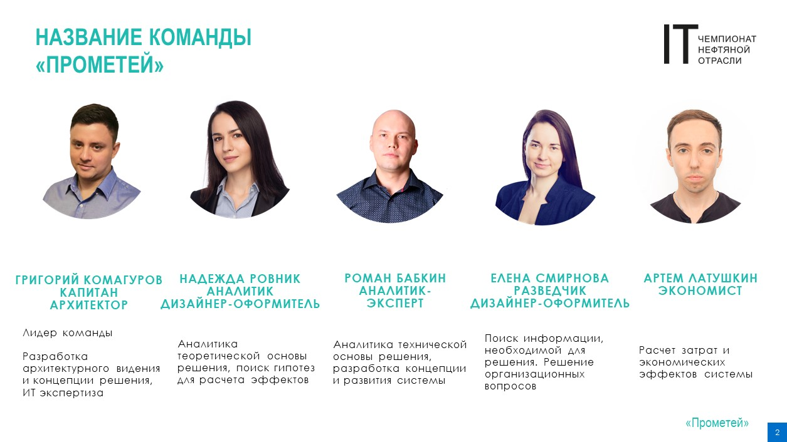
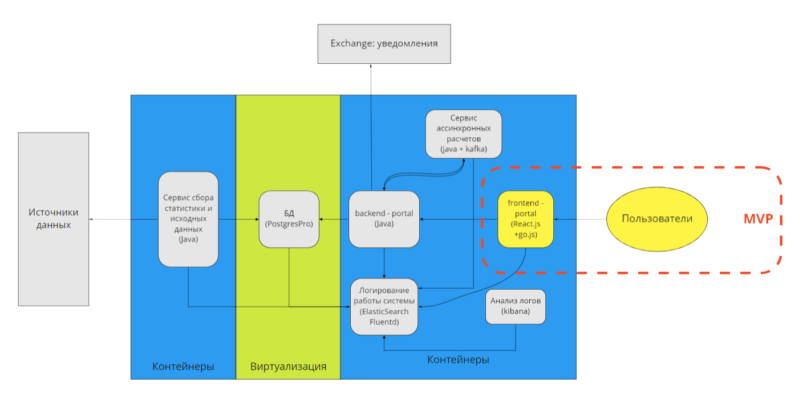
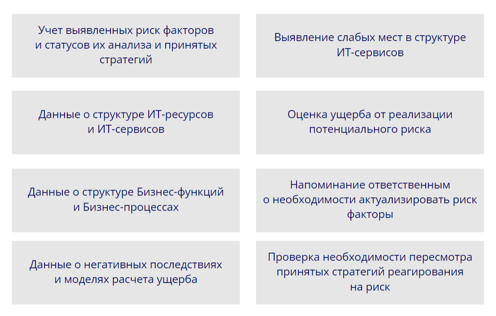

# Система: "Огонь"
Демо стенд решения доступен по [ссылке](https://it-championship-oil-industry-public.vercel.app/)
## Команда "Прометей" (ООО "Газпром-нефть ЦР")
  
Благодарим экспертов за ценные комментарии на ХАКАТОНЕ, представляем вам Прототип системы обеспечения непрерывности Центра управления строительством скважин.

## Содержание
- [Видеопрезентация](#1)  
- [Цель прототипа](#2)  
- [Реализация](#3)  
- [Поддержка](#4)  
- [Целевое видение системы](#5)  
- [Руководство по эксплуатации](#6)  
- [Запуск проекта](#7)  

## Видеопрезентация
https://youtu.be/fRxoAhDgQq0

## Цель прототипа
Цель прототипа предоставить интерфейс для работы с математической моделью, попробовать оценить различные конфигурации ИТ-ресурсов и оценить различные сценарии отказов.

## Реализация
Веб-приложение, в которое заложены алгоритмы оценки ущерба и анализа различных сценариев без сохранения в базу данных. Пользователь может сохранять свои данные в файл, затем возвращаться к веб-приложению и продолжать работать с ранее сохраненными конфигурациями и сценариями, а также делиться ими с другими пользователями. В решении использована сторонняя библиотека go.js для визуализации диаграммы дерева отказов и React.js - JavaScript-библиотека для создания пользовательских интерфейсов.

## Поддержка
Достаточно, чтобы функционировал веб-сервер с фронт-энд частью. Сложное конфигурирование фронт-энд части не требуется. На этапе MVP можно получать пользу от продукта без дополнительной регистрации и специального обучения пользователей. Интерфейс интуитивный.

## Целевое видение системы

Cистема клиент-серверного исполнения, многопользовательская, идентификация и авторизация пользователей через AD, распределение нагрузки при расчете, централизованное хранение данных. Stateless компоненты упакованы в контейнеры на корпоративной платформе контейнеризации. Statefull компонент - база данных - на корпоративной платформе виртуализации с организованной системой резервного копирования.

В целевом виде развертывание системы будет производиться автоматически на основе созданных сценариев DSO. Аналогичным образом будет производиться установка обновлений. В ходе сборки приложения подразумевается выполнение сценариев автоматического тестирования.

Целевое содержание функций системы:

## Руководство по эксплуатации
1. Добавьте  элементы дерева отказов в одноименном разделе.
2. Перейдите в раздел "Варианты дерева отказов". Введите с клавиатуры название новой конфигурации и нажмите "+" - добавится пустое дерево отказов, в которое вы можете добавить элементы и установить между ними связи. Вы можете перетаскивать элементы на поле диаграммы. Также вы можете приближать или отдалять области дерева для более удобной работы. Для этого можно зажать клавишу Ctrl и прокручивать колесо мыши вперед/назад.
3. Перейдите в раздел "Сценарии отказов" и для новой конфигурации добавьте сценарий, также вы можете задать имя сценария.
4. По умолчанию сценарий заполняется для оценки слабых мест конфигурации и максимальных простоев. Вы можете активировать Сценарий частичного отказа (кнопка) и затем вручную задать отказавший узел путем ввода тестового RTO. Далее сможете по дереву отказов оценить влияние этого узла на бизнес. Как и при работе с деревом, у вас есть возможность приближать или отдалять области дерева для более удобной работы.

## Запуск проекта
Для запуска проекта необходимо выполнить следующие команды:

-  Установить зависимости:  
`$ yarn`
- Запустить сервер:  
`$ yarn start`
- После запуска сервера откроется браузер по адресу:  
[http://localhost:3000](http://localhost:3000)
